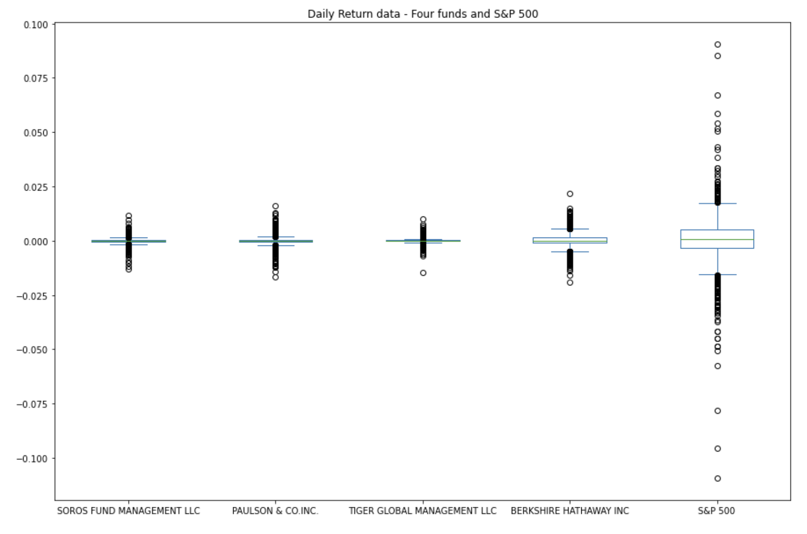
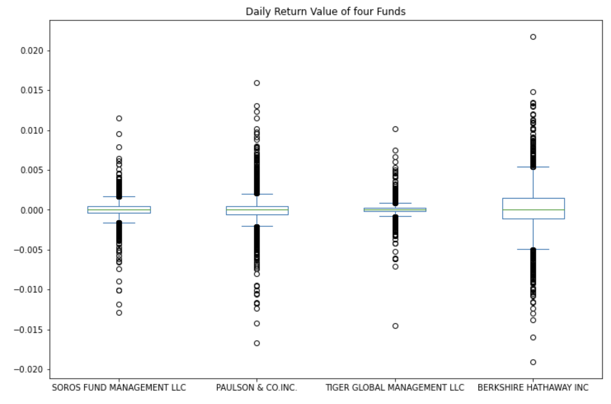
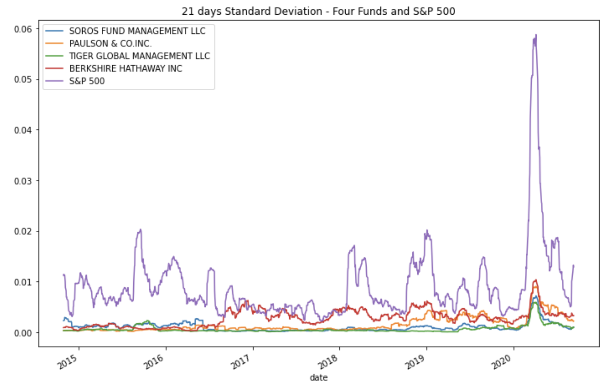
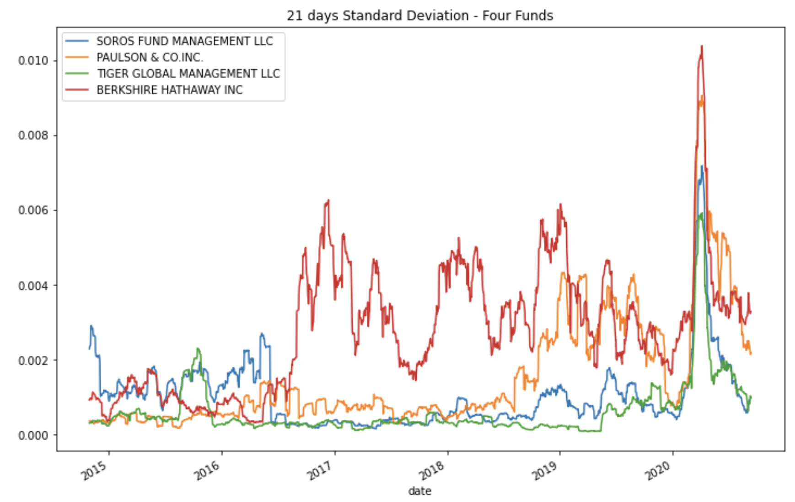
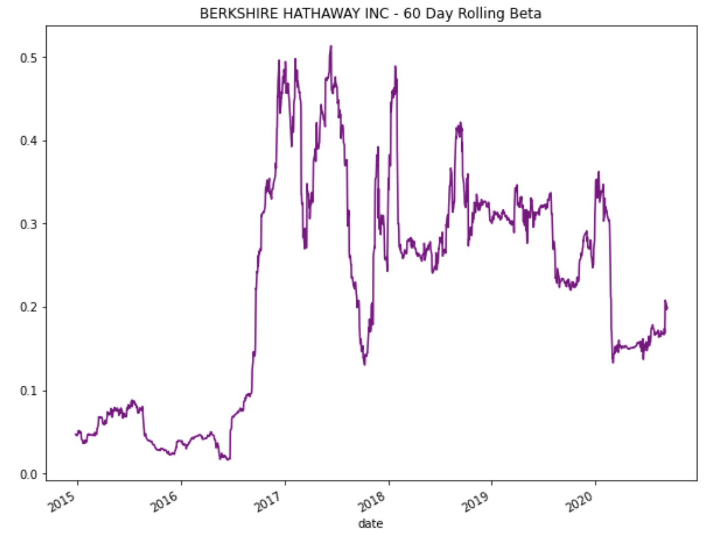
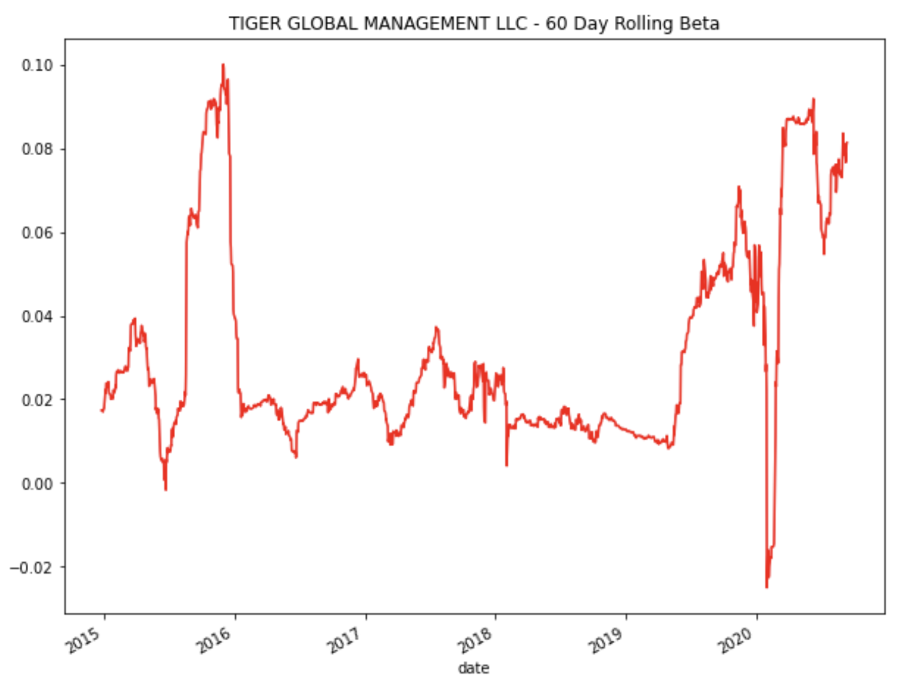

# Portfolio-Risk-Return-Analysis
Investment solution for retirement portfolio

This is a python enabled command line interface that represents Portfolio risk return analysis for a Fintech investing platform. This platform offer their client one stop inexpensive and high quality retirement portfolios solution that uses algorithms from various investment style and options.

This analysis determine the fund with the most investment potential to include in the portfolio.This includes a comprehensive quantity analysis of the following:

* Performance
* Volatality
* Risk
* Risk-return profile
* Portfolio diversification


## Technologies
This project runs on python 3.7 and includes the following libraries and dependencies:

* Pandas
* Pathlib
* Matplotlib inline
* Jupyter Notebook
* numpy

## Installation Guide

To use the application you need to install the following dependencies.

```python
  pip install matplotlib
  pip install pathlib
```
---

## Usage

To use this application just clone the repository and run the **jupyterlab** by running the following command on your terminal:

```jupyterlab```

Upon launching the application  on jupyter lab run the file by clicking on the play button on top of the notebook. 

### Usage Examples

## Quantitative Analysis

This analysis determines the fund with fund with the most investment potential based on key risk-management metrics: 

* The daily returns, 
* Standard deviations, 
* Sharpe ratios, and
* Betas


### Performance Analysis ###


As per the plot, we can see that none of the four fund could outperform S&P 500 Index.By the end of 2020 the market index S&P 500 was still going high with the cumulative return of 171.89% while BERKSHIRE HATHAWAY INC with 123.67% of cumulative return followed by TIGER GLOBAL MANAGEMENT LLC with 105.5% which is far below from the market.


## Volatality Analysis ##





From the box plot, we can observe that the S&P 500 has the largest spread compared to the four funds. The larger box size, longer whiskers and several outliers indicates that the S&P 500 is highly volatile.





As per the box plot visual, Berkshire hathway inc appears to have the greatest spread with longer whiskers and outliers spreded far away indicating the higher volatility of the asset while Tiger global management LLC has the smallest spread with smaller box, shortest whiskers and only two outliers indicates that it is the least volatile fund.


## Risk Analysis ##





BIRKSHIRE HATHWAY INC is having the highest annualized standard deviation but it is still less than S&P 500 that is 0.183345(18.33%) Vs 0.051692(5.17%) which means none of the fund is riskier than S&P 500.

There is no consistent rise of risk among the funds from 2015 to the early 2020 with the increasing risk of S&P 500. But around the middle period of 2020, from the visual(21 days Standard Deviation - Four Funds and S&P 500"), we can tell that all the funds are rising upwards along with S&P 500.





 As per the box plot of rolling standard deviations of only the four fund portfolios, with the largest spread Birkshire hathway inc is the most risky fund among the all four funds.This makes sense because it has the highest standard deviation among all four funds.

As per the rolling standard deviation visual the trajectory of Birkshire Hathway INC appears quite interesting. For the given period, initially Birkshire Hathway INC was not showing much volatility. it's big move took place in 2016 and since then it has remained the highest volatile asset among all four funds.


## Analyze the Risk-Return Profile ##


[](risk_return_analysis.ipynb)


BERKSHIRE HATHAWAY INC is having the best risk-return profile with the highest sharp ratio of 0.717512 and SOROS FUND MANAGEMENT LLC with a Sharpe ratio of -0.102290, has the worst risk-return profile.This means that from a risk-return perspective BERKSHIRE HATHAWAY INC offers a considerably better investment opportunity .


## Diversify the Portfolio ##







As per the above visuals, BERKSHIRE HATHAWAY INC seems more sensitive to movements in the market especially from mid 2016 it is experiancing high volatality followed by TIGER GLOBAL MANAGEMENT LLC.


## Conclusion ##

As per the analysis after measuring all the key metrics it is clear that BERKSHIRE HATHAWAY INC is a high risk/ high return investment.It is the most volatile asset with the highest standard deviation (0.00356) along with the highest beta of 0.221498 or 22.15%, and hence the higher risk investment. At the same time its a high return asset with the cumulative return of 123.67% and the sharp ratio of 0.717512 among all the four funds.

In contrast, TIGER GLOBAL MANAGEMENT LLC has the least standard deviation (0.000996) that makes it a low risk investment with a cumulative return of 105.5% and a sharp ratio of 0.579002 which is second best after S&P 500. Its beta(0.0309300) is also low compared to BERKSHIRE HATHAWAY INC.

Since we are determining investment solution for the retirement portfolio, my two best recommendation would be BERKSHIRE HATHAWAY INC and TIGER GLOBAL MANAGEMENT LLC.These two investments would balance the portfolio perfectly as both represents a good risk-return profile.

___


## Contributers

Manisha Lal
07/11/2022
manisha.lal.2009@gmail.com
___


## License

copyright 2022